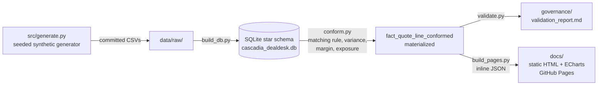

# Cascadia Deal Desk

**Pricing governance and margin leakage analytics.** Part of the
[Cascadia portfolio](https://robbinsanalytics.github.io) by Aaron Robbins.

> **Synthetic data, seeded generator. Simulated — not real company data.**
> Every customer, part number, price, and person in this repository was invented
> by [`src/generate.py`](src/generate.py) from a fixed seed. There is no real
> pricing data in this project and there never will be.

## The problem

A supplier in a capacity-constrained market signs multi-quarter pricing
agreements: the customer commits volume, the supplier commits capacity, and the
price is locked — often at a premium above what that customer previously paid.

Four things then go wrong, and this module models all four.

1. **The agreement is not a dataset.** Terms are negotiated in spreadsheets and
   end life as a signed PDF. Nothing downstream can query them.
2. **Quoting is disconnected from the agreement.** Quotes are entered in a system
   with no link to the agreement, so reps quote the customer's *previous* price
   and the negotiated premium is never captured.
3. **Controls only catch catastrophes.** Deviations route for approval only when
   they fall far below target, so moderate leakage passes silently.
4. **Verification is manual and therefore infrequent.** A spreadsheet is
   reconciled against bookings weekly or monthly, so leakage is found long after
   the quote went out.

And a fifth, separate ask: understanding how one customer's pricing and margin
have behaved over a period should not be an ad-hoc analysis every time.

## What this module argues

Not "I can build a dashboard." Three things:

- that a pricing agreement should be a **governed dataset**, not a document;
- that an exception is only actionable once it **carries a dollar figure**;
- that you **calibrate a rule before you automate an alert** on it.

## The governance moves

| Concern | Handling |
|---|---|
| The agreement is a PDF | A governed register — `dim_agreement` — with customer, scope, agreed price, effective window, committed capacity, approval reference, supersession pointer, and the prior price the premium was negotiated against |
| Matching a quote to its agreement | Documented rule with an explicit tiebreak order, in [`governance/matching_rules.md`](governance/matching_rules.md), with a worked example for every case |
| Agreements that overlap, renew, or expire | Status judged **as of the quote date**, not as of today — a quote is governed by whatever was in force the day it went out |
| Two agreements tie after every rule | The run **fails**. A tie is a register defect, not a judgment call; picking one arbitrarily produces an authoritative-looking number that cannot be reproduced |
| Quotes with no governing agreement | Reported explicitly as its own risk category, broken out by cause (lapsed / launched after / never covered) — never dropped |
| Flagging vs quantifying | Every off-agreement line carries a price variance in dollars and percent plus a margin impact, ranked by dollar exposure |
| Legitimate deviations | Approved exceptions carry an approval reference and a reason code, and are excluded from leakage totals but **retained** so the threshold can be calibrated against real false positives |
| Money gone vs money still recoverable | `fact_booking` keys back to the quote line, splitting exposure into `realized`, `open`, and `closed_lost` |
| Cost moving under a locked price | Standard cost steps quarterly, so "agreement honoured, margin still fell" is a **separate, detectable finding** from leakage |
| The `margin_impact = −price_variance` identity | [Stated first](governance/matching_rules.md#6-the-margin-identity--stated-first-on-purpose), computed the long way, and reconciled by an automated check |
| Verification | [`governance/validation_report.md`](governance/validation_report.md), auto-generated by `validate.py`: 12 checks including a **realism audit** that fails the run if the dataset stops telling a story |
| Provenance | The synthetic-data disclosure is carried in the JSON `meta` block and rendered above the first number on every page |

## Architecture



- **Python** (pandas + stdlib `sqlite3`, pinned in `requirements.txt`) does all
  processing. Every script is written as a teaching artifact.
- **No network access anywhere.** There is no ingestion step and no `requests`
  dependency. All data is generated locally from seed `20260801`.
- **Derived fields are materialized**, not left to a view or to JavaScript. The
  frontend receives arithmetic it does not have to redo — which is why numbers
  on two different pages agree with each other.
- **The frontend is dependency-light static HTML** with Apache ECharts, hosted on
  GitHub Pages. The JSON is inlined at build time, so the published page makes
  **no runtime network call** and works offline, including from `file://`.

## Rebuild (one command path, offline)

```powershell
pip install -r requirements.txt
python src/generate.py     # seeded generator -> data/raw/*.csv + generator_assumptions.md
python src/build_db.py     # CSVs             -> SQLite star schema (foreign keys enforced)
python src/conform.py      # matching rule    -> fact_quote_line_conformed (materialized)
python src/validate.py     # 12 checks        -> governance/validation_report.md (exit 1 on failure)
python src/build_pages.py  # conformed data   -> docs/data/dealdesk.json + inline injection
```

`generate.py` is deterministic: the same seed produces byte-identical CSVs.
`validate.py` proves it by regenerating into a temporary folder and diffing the
output file by file, then records the database content hash in the report.

## The data contract (`docs/data/dealdesk.json`)

Emitted by `build_pages.py`. Self-describing, ~1.1 MB, with these top-level keys:

| Key | Contents |
|---|---|
| `meta` | Seed, as-of date, database content hash, row counts, status counts, **`disclosure`** and **`provenance`** strings, params (tolerance, date range, controlled vocabularies), and definitions for the non-obvious measures |
| `dimensions` | `customers`, `products`, `reps` |
| `agreements` | The **full** register, including `superseded` and `expired` rows, so the customer page can draw an agreement timeline showing renewals and supersessions |
| `lines` | Every quote line at line grain — `{fields: [...], rows: [[...]]}` |
| `standard_costs` | Product cost by effective window |

`lines` is **columnar** (a `fields` array plus arrays of values) rather than an
array of objects — at ~3,000 rows that is roughly a third of the bytes. Rebuild
objects on the page with:

```js
const data  = JSON.parse(document.getElementById('dealdesk-data').textContent);
const { fields, rows } = data.lines;
const lines = rows.map(r => Object.fromEntries(fields.map((f, i) => [f, r[i]])));
```

It ships **every** line, not just exceptions: the customer page needs all of them
for revenue, mix, and margin over time, and the exception page filters down from
the same array. Floats are rounded to 4 decimal places; full precision stays in
the database. Nothing is pre-aggregated, because the frontend filters
client-side by customer, date range, and materiality threshold and recomputes its
chart titles from whatever survives the filter.

### The injection marker contract

`build_pages.py` inlines the JSON into every `.html` file in `docs/`. Put this
line, **exactly**, in any page that needs the data:

```html
<script id="dealdesk-data" type="application/json">/*__DEALDESK_DATA__*/</script>
```

The script finds the element by its `id` and replaces whatever sits between the
tags. It is **idempotent** — running it twice produces an identical file — and it
does not fail when `docs/` contains no HTML yet. It prints how many files it
processed, and names any page missing the marker.

## What this deliberately does not do

- **It does not measure anything real.** The data is invented. It demonstrates a
  design; it is not a finding about any company.
- **It does not fire alerts.** Design point 5 is *exception report first, trigger
  second* — the threshold is a control you drag, so it can be calibrated against
  real exceptions before anyone automates on it.
- **It does not claim the matching rule is validated by the data.** The generator
  imports the same matcher, which proves the pipeline is *consistent*, not that
  the rule is *correct*. Correctness is argued by worked examples and by identity
  checks that do not depend on the matcher. This is stated plainly in
  [`matching_rules.md`](governance/matching_rules.md#8-honest-limits).
- **It does not model a discount schedule.** Family-scope agreements carry a
  single unit price, which works here only because part prices within a family
  sit within ±12% of a family base.

## Layout

```
src/generate.py      seeded synthetic generator -> data/raw/*.csv
src/build_db.py      CSVs -> SQLite star schema
src/conform.py       the matching rule + all derived fields (materialized)
src/validate.py      12 PASS/FAIL checks -> governance/validation_report.md
src/build_pages.py   -> docs/data/dealdesk.json, inlined into docs/*.html
governance/matching_rules.md        the rule, in plain English, with worked examples
governance/generator_assumptions.md every tunable assumption + the realized mix
governance/validation_report.md     auto-generated
```

---

*Synthetic data, seeded generator. Simulated — not real company data.
Independent portfolio project; illustrates a pricing-governance design on
invented data only. Not affiliated with, endorsed by, or based on non-public
information from any company.*
